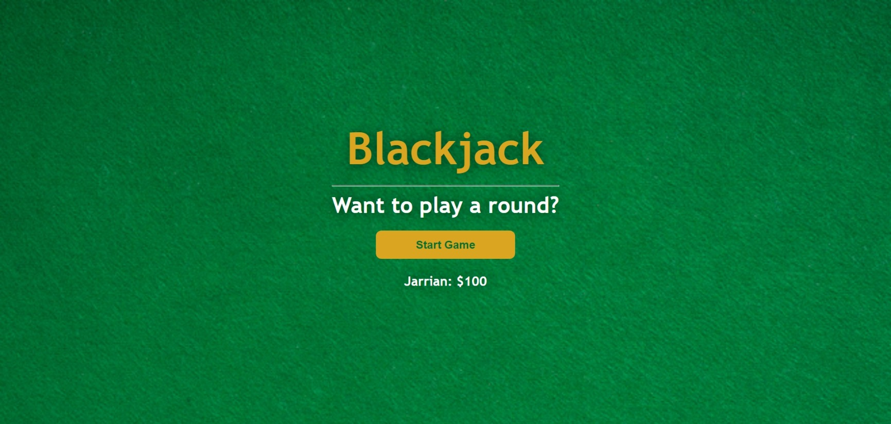
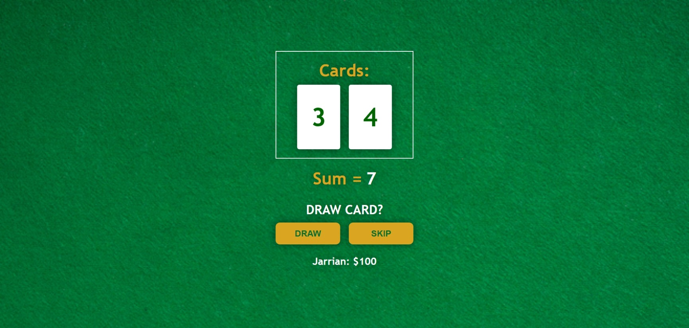
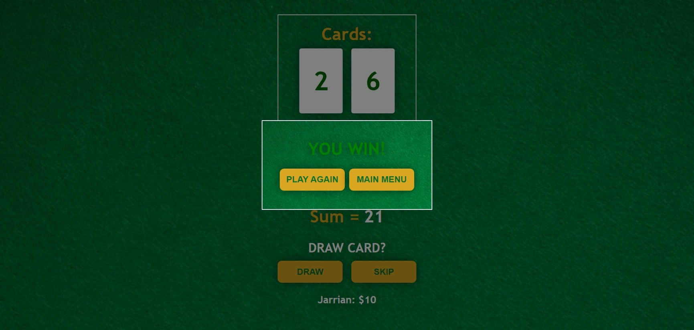
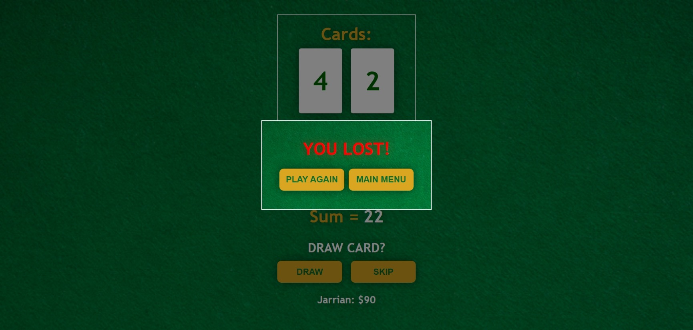

# Scrimba - JavaScript Free Course (Build A Passenger Counter App)

This is my code of the "Build a Blackjack Game" challenge of Scrimba.

## Table of contents

- [Overview](#overview)
  - [The challenge](#the-challenge)
  - [Screenshot](#screenshot)
  - [Links](#links)
- [My process](#my-process)
  - [Built with](#built-with)
- [Author](#author)

## Overview

### The challenge

Build an interactive app that lets you play a Blackjack Game. App should:

- Mainmenu which has a start game button and displays player profile as well as chips.
- Game-UI that displays the cards and sum as well as the draw and skip buttons.
- Victory and Defeat Interface that displays the victory and defeat message as well as two buttons: Play Again and Main Menu which lets you restart the game and go to the main menu, respectively.
- Victory will increase the player's chips. While Defeat does the opposite. Victory and Defeat should also update the chips display.
- Game should reset if restarted.
- Game should be responsive.

### Screenshot

### Links

- Live Site URL:
  --->[LINK](https://godkingjay.github.io/SCRIMBA-JS-Blackjack-Game/)

## My process

### Built with

- Semantic HTML5 markup
- CSS custom properties
- Flexbox
- Grid
- Javascript

## Author

- Twitter - [@godking_jay](https://www.twitter.com/godking_jay)